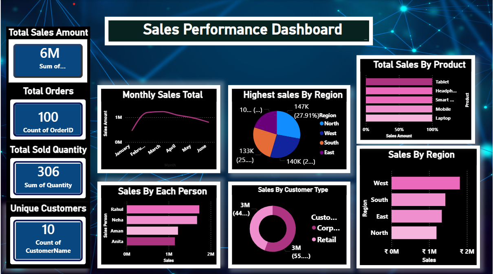

# PowerBi
I am starting to learn power bi for data analyst role so i am putting all my practice things here

# Power BI Sales Dashboard (Beginner Level)

## 📊 Project Overview
This project is a beginner-level Power BI sales dashboard created using sample sales data.
It answers basic business questions related to sales performance.

## 📁 Dataset
- 100 sales records
- Products, Customers, Regions

## 📌 Key Metrics
- Total Sales Amount
- Total Orders
- Total Quantity Sold
- Sales by Region
- Top-selling Product

## 📈 Dashboard Preview

## 🛠 Tools Used
- Power BI Desktop
- Microsoft Excel

## 🎯 Skills Demonstrated
- Data modeling
- Basic DAX measures
- KPI cards
- Bar and pie charts

## 📂 How to Use
1. Download the `.pbix` file
2. Open in Power BI Desktop
3. Refresh data if needed

